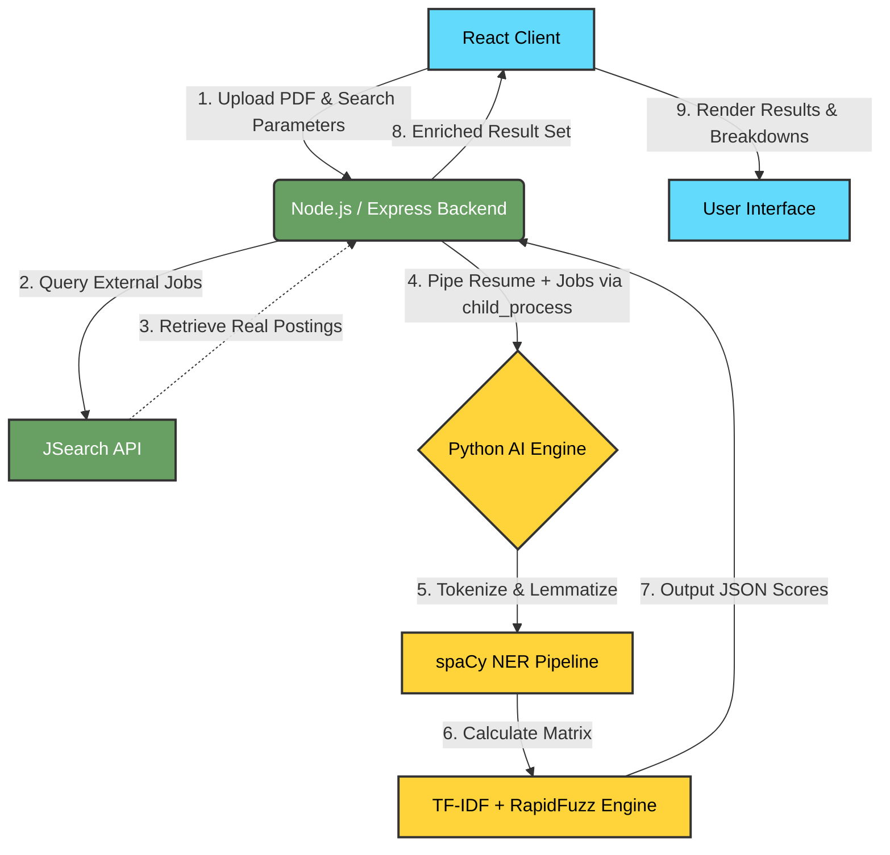

# 🚀 matchHire.ai

**matchHire.ai** is an AI-powered, real-time semantic job matching system designed to revolutionize the recruitment process. Unlike traditional keyword-based filters, matchHire.ai leverages a hybrid Natural Language Processing (NLP) framework and Named Entity Recognition (NER) to intelligently understand a candidate's resume and align it dynamically with real-world job postings.

---

## 🌟 Key Features

- 📑 **Smart PDF Extraction**: Seamlessly parses user resumes into raw text data.
- 🌍 **Real-Time Job Fetching**: Integrates with the JSearch API to pull verified, live job postings matching the user's location and desired industry.
- 🧠 **NER-Enhanced Skill Extraction**: Utilizes a 3-layer `spaCy` NLP pipeline to intelligently map skills while avoiding false positive keywords (e.g., distinguishing between a person named "Ruby" and the "Ruby" programming language).
- 📊 **Hybrid Scoring Engine**: Employs a robust composite scoring algorithm designed around 4 distinct signals:
  1. **Skill Recall (55%)**: Exact and fuzzy string matching (`RapidFuzz`) of required skills.
  2. **Semantic Match (20%)**: TF-IDF context embeddings capturing domain relevance.
  3. **Position Bonus (15%)**: Weighted scoring based on skill positioning within the resume.
  4. **Extra Skills (10%)**: Compensates broad multi-disciplinary knowledge.
- 🎨 **Premium UI/UX**: A responsive, glassmorphic React dashboard featuring color-coded visual scoring limits and comprehensive score breakdown analytics.

---

## 🏗️ System Architecture

The project operates across a three-tier architecture ensuring clean separation of concerns:



---

## 🛠️ Technology Stack

| Layer | Technologies Used |
| :--- | :--- |
| **Frontend** | React 19, Vite, Tailwind CSS v4, Axios |
| **Backend** | Node.js, Express.js, Multer, `pdf-parse` |
| **AI / Machine Learning** | Python 3, `scikit-learn` (TF-IDF), `spaCy` (NER & Lemmatization), `rapidfuzz` (string matching) |

---

## 🚀 Installation & Setup

> [!IMPORTANT]
> To run this project locally, you must install Node.js (v18+) and Python 3.10+. Provide your own RapidAPI / JSearch API key inside a `.env` file within the `backend/` directory.

### 1. Setup the Python AI Engine
```bash
cd ai-engine
# Install core Python dependencies
pip install scikit-learn rapidfuzz spacy

# Download the English NER model
python -m spacy download en_core_web_sm
```

### 2. Setup the Node.js Backend
```bash
cd ../backend

# Install node modules
npm install

# Create environment variables (.env)
echo "PORT=5000" > .env
echo "RAPIDAPI_KEY=your_rapid_api_key_here" >> .env

# Run the backend
npm run dev
```

### 3. Setup the React Frontend
```bash
cd ../frontend

# Install node modules
npm install

# Run the Vite dev server
npm run dev
```

Visit `http://localhost:5173/` in your browser.

---

## 🔍 How the AI Engine Works (In Depth)

The `matcher.py` script receives requests via standard input (IPC). It implements a cutting-edge skill-extraction methodology:

1. **PhraseMatcher**: A custom dictionary (`TECH_SKILLS`) is injected into the NLP engine to correctly identify heavy multi-word skill sets ("machine learning", "react native") without splitting context.
2. **Entity Exclusion**: The pre-trained `en_core_web_sm` model flags semantic clusters (`PERSON`, `ORG`, `GPE`). If a term maps to an Organization (like "Microsoft"), it skips analyzing it as an applicable trait *unless* the dictionary aggressively overrides it.
3. **Normalization**: Every token extracted is cross-referenced using a curated Synonym Lexicon (e.g. `K8s` -> `Kubernetes`, `JS` -> `JavaScript`).

> [!TIP]
> **Extending the Engine**: To add new skills or support entirely new industries, open `ai-engine/matcher.py` and modify the `TECH_SKILLS` set and `SYNONYMS` dictionaries.

---

## 📄 License & Academic Integrity

This project is authored as a Final Year Project. Architecture decisions, custom styling, tailored NLP methodology, and overall structure were deeply optimized to handle accurate real-world context data. All external libraries conform to MIT / open-source licensing.
