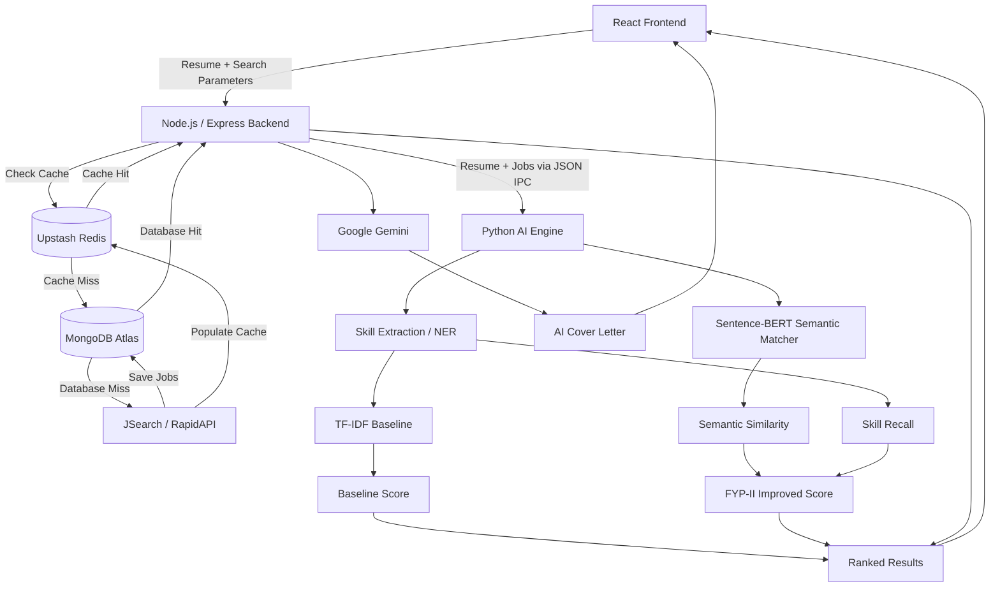

# matchHire.ai

**AI-Powered Job Matching System**

matchHire.ai is an AI-powered job matching platform that helps candidates discover relevant job opportunities by analyzing resume content, extracting skills, and comparing candidate profiles with job descriptions. The system combines a Node.js/Express backend, React frontend, MongoDB Atlas, Upstash Redis, and a Python NLP/ML engine.

The project was developed in two major stages. **FYP-I established the complete working job-matching platform and its baseline NLP approach. FYP-II extends that baseline with Sentence-BERT semantic matching, an improved hybrid score, formal evaluation, production integration, user authentication, persistent user features, and AI-powered cover-letter generation.**

---

## Key Features

### Resume & Candidate Processing

- PDF resume upload through the web application.
- Server-side PDF text extraction using `pdf-parse`.
- Persistent storage of extracted resume content.
- Resume filename and update timestamp storage.
- Protected resume retrieval through the backend.
- Skill extraction using the project's NLP pipeline.
- Named Entity Recognition (NER) and rule-based techniques to improve skill detection.
- Skill normalization and synonym handling for common technology variations.

### Job Discovery

- Job search through the JSearch API via RapidAPI.
- Search by job role/keyword and location.
- Job results are stored locally in MongoDB Atlas to reduce repeated external API requests.

### Three-Tier Job Retrieval

The application uses a cache-first architecture:

```text
User Search

    ↓

Redis Cache

    ↓ cache miss

MongoDB Atlas

    ↓ database miss

JSearch API

    ↓

Save to MongoDB + Redis

    ↓

Return Jobs
```

This architecture is designed to reduce API usage and improve repeated-search response time.

### AI Job Matching

The project contains two matching approaches so the FYP-II model can be evaluated against the FYP-I baseline.

**FYP-I baseline:**

```text
Skill Extraction

      +

TF-IDF Vectorization

      +

Cosine Similarity

      +

Existing Hybrid Scoring

      ↓

Baseline Job Score
```

**FYP-II improved approach:**

```text
Skill Extraction

      +

Sentence-BERT Semantic Similarity

      ↓

Harmonic-Mean Based Improved Score
```

The current FYP-II improved score combines Sentence-BERT semantic similarity and skill recall using a harmonic mean rather than introducing arbitrary weighted coefficients. The original FYP-I baseline score is preserved separately for controlled comparison.

### Explainable Matching

The matching results can expose information such as:

- Matched skills
- Missing skills
- Additional/extra skills
- Skill recall
- TF-IDF similarity
- Sentence-BERT semantic similarity
- Existing baseline score
- FYP-II improved score
- Improved-score components
- Semantic inference timing where available

### Authentication

The application now supports user authentication through:

- Email/password registration
- Email/password login
- JWT-based authentication
- Protected routes
- Logout
- Real Google Sign-In using Google Identity Services
- Google ID-token verification on the backend
- MongoDB user creation/lookup for Google-authenticated users
- Show/hide password controls in authentication forms

> LinkedIn authentication is not listed as complete here unless it has been separately configured and tested in the current codebase.

### User Experience

- React/Vite frontend
- Job result cards with match information
- Baseline vs FYP-II hybrid score display
- Client-side ranking by available baseline or improved scores
- Guided/onboarding tour with six steps
- Responsive interface
- Light and dark mode
- Professional Lucide icon system
- UI reference designs stored under `design-reference/`
- Favorite Jobs
- Applied/Clicked Jobs
- Profile & Settings
- Persistent Resume management
- AI-powered Cover Letter generation

### Favorite Jobs

Authenticated users can save real job listings for later review.

- Save and remove real jobs
- Persistent MongoDB storage
- Duplicate-save protection
- Favorite state synchronization
- Dedicated Favorite Jobs page
- Empty and error states

### Applied / Clicked Jobs

The system records meaningful interactions with real job listings.

- Real external job/application click tracking
- Stable job identifiers
- Job title, company, location, application URL
- Baseline and FYP-II scores where available
- Click timestamps
- Idempotent duplicate interaction handling
- Dedicated Applied / Clicked Jobs page

### Profile & Settings

Authenticated users can manage supported profile information.

- Display authenticated user information
- Edit the supported profile name
- Persist updates in MongoDB
- Read-only email display
- Validation and save confirmation
- Theme preferences
- Protected profile API

### Resume & Cover Letter

The Resume & Cover Letter section provides:

- Persistent extracted resume content
- Resume filename and update time
- Read-only resume preview
- Real job selection for cover-letter generation
- AI-powered cover-letter generation
- Editable generated letter
- Regenerate
- Copy
- `.txt` download
- Loading, validation, and error states

### AI-Powered Cover Letter Generation

The application uses Google Gemini through the backend to generate job-specific cover letters from the user's persisted resume and a real selected job.

```text
Persisted Resume

       +

Real Selected Job

       ↓

Node.js / Express Backend

       ↓

Google Gemini

       ↓

Tailored Cover Letter

       ↓

Editable Cover Letter

       ↓

Copy / Download / Regenerate
```

The current implementation uses `@google/genai` with `Gemini 3.6 Flash`.

The generation workflow is designed to use only information supported by the resume and job data and to avoid fabricating qualifications, experience, certifications, employers, degrees, projects, or achievements.

---

## System Architecture



---

## Technology Stack

| Layer | Technologies |
|---|---|
| Frontend | React 19, Vite, Axios, custom CSS |
| UI Icons | Lucide React |
| Backend | Node.js, Express.js, Multer, `pdf-parse`, Mongoose, `ioredis` |
| Database | MongoDB Atlas |
| Cache | Upstash Redis |
| External Jobs API | JSearch via RapidAPI |
| AI / NLP | Python, scikit-learn, spaCy, RapidFuzz, Sentence-Transformers |
| Semantic Model | `all-MiniLM-L6-v2` |
| Authentication | JWT, bcrypt/bcryptjs, Google Identity Services, `google-auth-library` |
| Generative AI | Google Gemini via `@google/genai` |
| Cover Letter Model | Gemini 3.6 Flash |

---

## Project Structure

```text
matchHire/

│

├── backend/

│   ├── config/

│   │   └── db.js

│   ├── controllers/

│   │   ├── authController.js
│   │   ├── appliedController.js
│   │   ├── coverLetterController.js
│   │   ├── favoriteController.js
│   │   ├── jobController.js
│   │   ├── matchController.js
│   │   ├── profileController.js
│   │   ├── resumeController.js
│   │   └── uploadController.js

│   ├── middleware/

│   │   ├── authMiddleware.js
│   │   └── optionalAuthMiddleware.js

│   ├── models/

│   │   ├── Job.js
│   │   └── User.js

│   ├── routes/

│   │   ├── applied.js
│   │   ├── auth.js
│   │   ├── coverLetter.js
│   │   ├── favorites.js
│   │   ├── jobs.js
│   │   ├── match.js
│   │   ├── profile.js
│   │   ├── resume.js
│   │   └── upload.js

│   ├── services/

│   │   └── jobService.js

│   ├── server.js

│   ├── package.json

│   └── package-lock.json

│

├── frontend/

│   ├── src/

│   │   ├── App.jsx

│   │   └── ...

│   ├── vite.config.js

│   ├── package.json

│   └── .env.example

│

├── ai-engine/

│   ├── matcher.py
│   ├── semantic_matcher.py
│   ├── test_semantic_matcher.py
│   ├── phase3_test.py
│   ├── requirements.txt
│   │
│   ├── eval_phase4/
│   │   ├── dataset.json
│   │   ├── eval_phase4.py
│   │   ├── README.md
│   │   ├── results.json
│   │   └── results.csv
│   │
│   └── eval_phase5/
│       ├── dataset_candidates.json
│       ├── pairs_to_label.csv
│       ├── merge_labels.py
│       ├── eval_phase5.py
│       ├── README.md
│       ├── results_phase5.json
│       └── results_phase5.csv
│
├── design-reference/
│   └── UI reference screenshots
│
├── .env.example
├── .gitignore
└── README.md
```

---

# FYP-I Baseline

FYP-I focused on building a complete working prototype and establishing the initial NLP matching approach.

### FYP-I Work Completed

- System architecture and module planning.
- React frontend development.
- Node.js/Express backend.
- Resume PDF upload and text extraction.
- JSearch API integration.
- Redis caching.
- MongoDB Atlas persistent job storage.
- Skill extraction / NER pipeline.
- TF-IDF vectorization.
- Cosine similarity.
- Existing hybrid baseline scoring.
- Backend-to-Python AI integration.
- End-to-end resume-to-job matching workflow.

The original FYP-I hybrid baseline used four signals:

1. Skill Recall — 55%
2. TF-IDF Similarity — 20%
3. Position Bonus — 15%
4. Extra Skills — 10%

These weights belong to the **FYP-I baseline** and are kept for comparison with the FYP-II model.

---

# FYP-II Development

FYP-II focuses on improving semantic understanding, evaluating the improvement experimentally, integrating the new model into the production workflow, and extending the application with authenticated user features and AI-assisted career functionality.

## Phase 1 — Sentence-BERT Semantic Matching

Added a separate semantic-matching component using Sentence-Transformers and the `all-MiniLM-L6-v2` model.

The component:

- Loads Sentence-BERT locally.
- Creates dense embeddings for resume and job text.
- Calculates cosine similarity.
- Returns a normalized semantic similarity score.
- Handles missing/empty input safely.

A standalone test was created in `test_semantic_matcher.py`.

---

## Phase 2 — AI Pipeline Integration

Integrated the Sentence-BERT component into the existing Node.js → Python matching pipeline while keeping the FYP-I baseline intact.

Each job can now contain both the existing baseline information and the new semantic matching information.

---

## Phase 3 — Improved Hybrid Matching

The FYP-II model introduced an improved score based on the harmonic mean of:

- Sentence-BERT semantic similarity
- Skill recall

Conceptually:

```text
Semantic Similarity + Skill Recall

              ↓

        Harmonic Mean

              ↓

       Improved Score
```

This approach avoids arbitrarily selecting fixed weighting coefficients for the new semantic score and ensures that a high final value requires both semantic relevance and meaningful skill overlap.

The existing FYP-I baseline remains available separately.

---

## Phase 4 — Initial Evaluation

A controlled evaluation dataset was created to compare the FYP-I baseline with the FYP-II improved model.

The initial evaluation contained **18 resume-job pairs**.

Reported results from that experiment:

| Metric | FYP-I Baseline | FYP-II Improved |
|---|---:|---:|
| Precision | 1.0000 | 1.0000 |
| Recall | 0.4444 | 0.5556 |
| F1-score | 0.6154 | 0.7143 |
| Precision@1 | 1.0000 | 0.6667 |
| Precision@3 | 0.8889 | 0.6667 |

These results were treated as an initial experiment rather than a statistically conclusive generalization.

---

## Phase 5 — Expanded Evaluation

The evaluation framework was expanded with manually assigned relevance labels.

Dataset statistics from the completed run:

- 15 resumes
- 15 jobs
- 47 labeled resume-job pairs evaluated
- 36 relevant examples (`label >= 1`)
- 11 not-relevant examples (`label = 0`)

Labels:

```text
0 = Not relevant

1 = Moderately relevant

2 = Highly relevant
```

Binary evaluation maps labels `1` and `2` to relevant.

### Phase 5 Results

| Metric | FYP-I Baseline | FYP-II Improved |
|---|---:|---:|
| TP | 13 | 15 |
| TN | 11 | 11 |
| FP | 0 | 0 |
| FN | 23 | 21 |
| Precision | 1.0000 | 1.0000 |
| Recall | 0.3611 | 0.4167 |
| F1-score | 0.5306 | 0.5882 |
| Precision@1 | 1.0000 | 1.0000 |
| Precision@3 | 0.7778 | 0.7778 |

On this evaluation dataset, the FYP-II model produced higher recall and F1-score while maintaining the same precision and top-K precision values. Because the dataset is still modest in size, these results should be described as results for the evaluated dataset rather than universal performance claims.

The complete evaluation scripts and per-pair outputs are stored in `ai-engine/eval_phase4/` and `ai-engine/eval_phase5/`.

---

## Phase 6 — Error Analysis & Production Integration

The project then moved beyond offline evaluation and integrated the FYP-II matching outputs into the application.

Completed work includes:

- Preservation of the FYP-I baseline score.
- Exposure of the FYP-II improved score in the backend response.
- Exposure of semantic and skill-related score components.
- Frontend display of FYP-II matching information.
- Client-side ranking option using baseline or improved score.
- Continued use of the existing MongoDB/Redis/JSearch architecture.
- Error-handling and integration improvements.

The goal of this phase was to make the FYP-II model part of the actual MatchHire workflow without removing the FYP-I baseline.

---

## Phase 7 — User Product Features

The application was further extended with real authenticated and persistent product features.

Completed work includes:

- Email/password authentication.
- Real Google authentication.
- JWT-protected APIs.
- Guided onboarding tour.
- Favorite Jobs.
- Applied/Clicked Jobs.
- Profile & Settings.
- Persistent Resume management.
- AI-powered Cover Letter Generation.

These features are integrated into the existing user and backend architecture rather than being implemented as disconnected mock interfaces.

---

# Authentication

A complete authentication layer was added around the existing application.

### Email Authentication

- User registration.
- Input validation.
- Password hashing.
- Email uniqueness handling.
- Login with credentials.
- JWT issuance.
- Protected API routes.
- Logout.
- Password visibility controls.

### Google Authentication

Real Google Sign-In has been integrated using Google Identity Services.

Flow:

```text
Google Sign-In Button

        ↓

Google Authentication

        ↓

Google ID Token

        ↓

Node.js Backend

        ↓

Server-side Token Verification

        ↓

MongoDB User Lookup / Creation

        ↓

MatchHire JWT

        ↓

Authenticated User
```

Google authentication uses the existing Google Web OAuth client and keeps sensitive credentials out of the frontend.

### Authentication Security

- Passwords are not stored as plain text.
- JWT secret is kept in backend environment variables.
- Google client credentials are handled through environment configuration.
- Real `.env` files are excluded from Git.
- `.env.example` files contain placeholders only.
- Password fields are excluded from profile/resume API responses where applicable.

---

# Onboarding Tour

The authenticated application includes a guided first-time-user onboarding experience.

The tour includes:

- Welcome screen
- Take a Tour
- Skip for Now
- Six guided steps
- Back
- Next
- Finish
- Spotlight-based guidance
- Automatic navigation between Dashboard and Find Jobs
- Theme-aware styling
- Mobile-responsive behavior
- Local completion persistence

The six steps cover:

1. Dashboard workspace
2. Sidebar navigation
3. Resume upload
4. Role/location preferences
5. Results and match breakdown
6. Theme controls

The onboarding state is persisted so the tour does not repeatedly appear after completion or skipping.

---

# Favorite Jobs

Authenticated users can save real jobs for later review.

The feature includes:

- Save a real job.
- Remove a saved job.
- Duplicate-save protection.
- Persistent MongoDB storage.
- Favorite-state synchronization.
- Dedicated Favorite Jobs page.
- Loading, empty, and error states.

API endpoints:

```text
GET    /api/favorites
POST   /api/favorites
DELETE /api/favorites/:jobId
```

---

# Applied / Clicked Jobs

The application records meaningful user interactions with real job listings.

A real external job/application click can be recorded with:

- Stable job identifier
- Job title
- Company
- Location
- Apply URL
- Baseline score
- FYP-II hybrid score
- Click timestamp

Duplicate clicks are handled idempotently.

API endpoints:

```text
GET  /api/applied
POST /api/applied
```

---

# Profile & Settings

Authenticated users have a dedicated Profile & Settings section.

Current functionality includes:

- Display authenticated user information.
- Edit the supported profile name.
- Persist updates in MongoDB.
- Keep email read-only.
- Validate profile input.
- Display save confirmation.
- Handle backend errors.
- Preserve theme preferences.

API endpoints:

```text
GET /api/profile
PUT /api/profile
```

Sensitive password information is excluded from profile responses.

---

# Resume Management

The Resume & Cover Letter section provides persistent access to the user's extracted resume.

The User record stores:

```text
resumeText
resumeFileName
resumeUpdatedAt
```

The existing PDF upload pipeline remains the source of resume content.

Protected endpoint:

```text
GET /api/resume
```

The Resume page provides:

- Stored resume retrieval.
- Filename display.
- Last-updated information.
- Read-only extracted resume content.
- Missing-resume state.
- Loading state.
- Error state.
- Navigation back to Find Jobs.

---

# AI-Powered Cover Letter Generation

The project includes a real AI-powered cover-letter generation workflow.

### Technology

```text
Google Gemini
@google/genai
Gemini 3.6 Flash
```

### Flow

```text
Persisted Resume
       +
Real Selected Job
       ↓
Node.js / Express Backend
       ↓
Google Gemini
       ↓
Tailored Cover Letter
       ↓
Editable Letter
       ↓
Copy / Download / Regenerate
```

### Features

- Select a real matched/saved job.
- Generate a tailored cover letter.
- Use persisted resume content from MongoDB.
- Use actual job information.
- Edit the generated letter.
- Copy the current letter.
- Download as `.txt`.
- Regenerate the letter.
- Handle missing resume.
- Handle no-job-selected state.
- Handle API/configuration errors.
- Keep the Gemini API key on the backend.

Protected endpoint:

```text
POST /api/cover-letter/generate
```

The generation workflow is designed to prevent unsupported claims and fabricated candidate information.

The model is instructed not to invent:

- Degrees
- Certifications
- Employers
- Skills
- Years of experience
- Achievements
- Projects
- Qualifications
- Personal information

The actual Gemini integration was tested with a real authenticated account, persisted resume, and real job data. The successful generation flow returned a non-empty letter, which was then edited, copied, downloaded, and regenerated.

---

# Environment Variables

Create the required environment files locally. **Never commit real credentials.**

### Backend `.env`

```env
PORT=5000

RAPIDAPI_KEY=your_rapidapi_key

MONGO_URI=your_mongodb_connection_string

REDIS_URL=your_redis_url

REDIS_TTL_SECONDS=3600

JWT_SECRET=your_jwt_secret

GOOGLE_CLIENT_ID=your_google_web_client_id

GEMINI_API_KEY=your_gemini_api_key

GEMINI_MODEL=gemini-3.6-flash
```

### Frontend `.env`

```env
VITE_GOOGLE_CLIENT_ID=your_google_web_client_id
```

The actual values must remain local and must not be committed to GitHub.

The Gemini API key must only be used by the backend.

---

# Installation & Setup

## 1. Python AI Engine

From the project root:

```bash
cd ai-engine

python -m venv .venv
```

Activate the environment on Windows PowerShell:

```powershell
.\.venv\Scripts\Activate.ps1
```

Install dependencies:

```bash
pip install -r requirements.txt
```

If the NLP model required by the current matcher is not already installed:

```bash
python -m spacy download en_core_web_sm
```

The exact Python dependencies are defined in `ai-engine/requirements.txt`.

---

## 2. Backend

```bash
cd ../backend

npm install

npm start
```

Backend runs locally on:

```text
http://localhost:5000
```

---

## 3. Frontend

Open a second terminal:

```bash
cd frontend

npm install

npm run dev
```

Frontend runs locally on:

```text
http://localhost:5173
```

---

# Evaluation Reproduction

## Phase 3 semantic matcher test

From the project root:

```powershell
& ".venv/Scripts/python.exe" "ai-engine/phase3_test.py"
```

## Phase 4 evaluation

```powershell
& ".venv/Scripts/python.exe" "ai-engine/eval_phase4/eval_phase4.py"
```

## Phase 5 evaluation

First merge the manually assigned labels into the evaluation dataset if required by the current workflow:

```powershell
& ".venv/Scripts/python.exe" "ai-engine/eval_phase5/merge_labels.py"
```

Then run:

```powershell
& ".venv/Scripts/python.exe" "ai-engine/eval_phase5/eval_phase5.py"
```

The result files contain the per-pair model outputs and summary metrics.

---

# Security & Git

The repository intentionally excludes local secrets and generated development files.

Do not commit:

```text
.env
backend/.env
frontend/.env
.venv/
node_modules/
__pycache__/
*.pyc
.vscode/
```

Safe template files include:

```text
.env.example
frontend/.env.example
```

These should contain placeholders only.

Never commit:

- MongoDB credentials
- Redis credentials
- RapidAPI keys
- JWT secrets
- Gemini API keys
- Google OAuth secrets

---

# Current Project Status

The core MatchHire system currently includes:

- Working React frontend.
- Working Node.js/Express backend.
- Responsive desktop and mobile interface.
- Light/dark mode.
- 14 UI reference screenshots and corresponding redesign work.
- PDF resume processing.
- Persistent resume storage.
- JSearch API integration.
- Redis caching.
- MongoDB Atlas persistent job storage.
- Skill extraction / NER pipeline.
- FYP-I TF-IDF baseline.
- FYP-I hybrid scoring.
- FYP-II Sentence-BERT semantic matching.
- FYP-II improved hybrid score.
- Evaluation datasets and reproducible evaluation scripts.
- Production integration of FYP-II matching outputs.
- Email/password authentication.
- Real Google authentication.
- Guided onboarding tour.
- Favorite Jobs.
- Applied/Clicked Jobs.
- Profile & Settings.
- Persistent Resume management.
- AI-powered Cover Letter generation using Gemini 3.6 Flash.
- Editable AI-generated cover letters.
- Copy and `.txt` download functionality.
- Regeneration of AI-generated cover letters.
- Responsive mobile support.

---

# Remaining Work

The major implementation work for the current FYP-II scope is in place.

Remaining work is primarily focused on:

- Final system testing.
- Performance validation.
- Final UI/UX refinement where required.
- Additional approved product features.
- Final documentation and report writing.
- Conference-paper preparation.
- Presentation and demo preparation.
- Deployment preparation if required.
- Optional LinkedIn authentication if required and properly configured.

---

# Future Work

Potential future extensions include:

- Larger and more diverse labeled evaluation datasets.
- Stronger statistical evaluation of model differences.
- More advanced transformer-based semantic models.
- Improved personalization using user preferences and history.
- Saved-search and recommendation features.
- More advanced job recommendation strategies.
- Resume and job-history analytics.
- Additional OAuth providers such as LinkedIn if required and configured.
- Cloud deployment and production monitoring.
- Improved AI-assisted career tools.
- Advanced resume optimization and analysis.

Future features should be evaluated and validated before being presented as implemented functionality.

---

# Academic Note

matchHire.ai is a Final Year Project. The project separates the **FYP-I baseline model** from the **FYP-II improved semantic model** so that the effect of the FYP-II changes can be measured experimentally instead of being assumed.

All reported evaluation values in this README correspond to the project evaluation runs described above and should not be interpreted as universal performance guarantees.

The manually assigned Phase 5 relevance labels represent the project's evaluation process and should not be presented as independently annotated ground truth unless additional annotation procedures are performed.

---

## Authors

- **Hassan Fareed**

**National University of Computer and Emerging Sciences (FAST), Karachi Campus**
